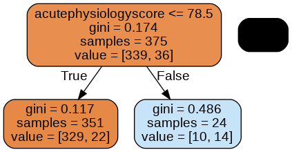

## The simplest tree

Let's build the simplest tree model we can think of: a classification tree with only one split. Decision trees of this form are commonly referred to under the umbrella term Classification and Regression Trees (CART) [1].

While we will only be looking at classification here, regression isn't too different. After grouping the data (which is essentially what a decision tree does), classification involves assigning all members of the group to the majority class of that group during training. Regression is the same, except you would assign the average value, not the majority.

In the case of a decision tree with one split, often called a "stump", the model will partition the data into two groups, and assign classes for those two groups based on majority vote. There are many parameters available for the DecisionTreeClassifier class; by specifying max_depth=1 we will build a decision tree with only one split - i.e. of depth 1.

[1] L. Breiman, J. Friedman, R. Olshen, and C. Stone. Classification and Regression Trees. Wadsworth, Belmont, CA, 1984.

```python
from sklearn import tree

# specify max_depth=1 so we train a stump, i.e. a tree with only 1 split
mdl = tree.DecisionTreeClassifier(max_depth=1)

# fit the model to the data - trying to predict y from X
mdl = mdl.fit(x_train, y_train)
```

Our model is so simple that we can look at the full decision tree.

```python
import glowyr
from IPython.display import display, Image

graph = glowyr.create_graph(mdl, feature_names=features)
img = Image(graph.create_png())
display(img)
```

{: width="400px"}

Here we see three nodes: a node at the top, a node in the lower left, and a node in the lower right.

The top node is the root of the tree: it contains all the data. Let's read this node bottom to top:

- value = [384, 44]: Current class balance. There are 384 observations of class 0 and 44 observations of class 1.
- samples = 428: Number of samples assessed at this node.
- gini = 0.184: Gini impurity, a measure of "impurity". The higher the value, the bigger the mix of classes. A 50/50 split of two classes would result in an index of 0.5.
- acutePhysiologyScore <=78.5: Decision rule learned by the node. In this case, patients with a score of <= 78.5 are moved into the left node and >78.5 to the right.

The gini impurity is actually used by the algorithm to determine a split. The model evaluates every feature (in our case, age and score) at every possible split (46, 47, 48..) to find the point with the lowest gini impurity in two resulting nodes.

The approach is referred to as "greedy" because we are choosing the optimal split given our current state. Let's take a closer look at our decision boundary.

```python
import matplotlib.pyplot as plt

# look at the regions in a 2d plot
# based on scikit-learn tutorial plot_iris.html
plt.figure(figsize=[10,8])
glowyr.plot_model_pred_2d(mdl, x_train, y_train, 
                       title="Decision tree (depth 1)")
```

{: width="600px"}

In this plot we can see the decision boundary on the y-axis, separating the predicted classes. The true classes are indicated at each point. Where the background and point colours are mismatched, there has been misclassification. Of course we are using a very simple model. 



