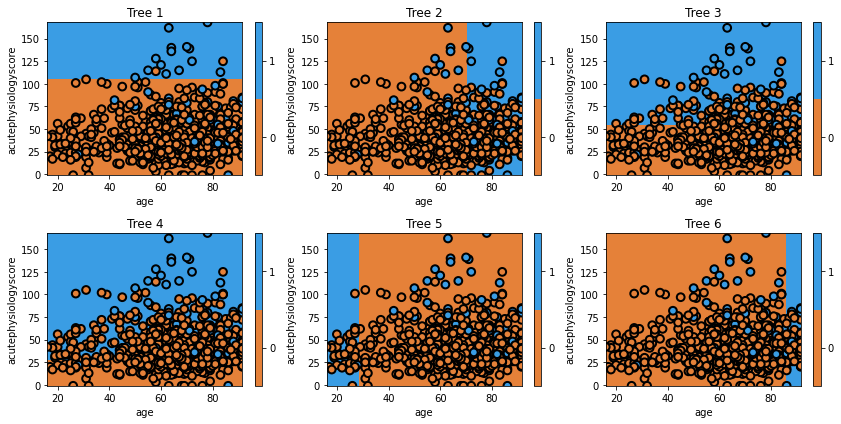
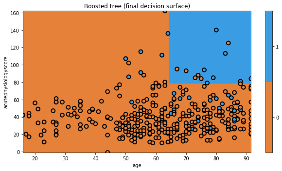

## Boosting

In the previous episode, we demonstrated that decision trees may have high "variance". Their performance can vary widely given different samples of data. 

An algorithm that performs somewhat poorly at a task - such as simple decision tree - is sometimes referred to as a "weak learner".

The premise of boosting is the combination of many weak learners to form a single "strong" learner. In a nutshell, boosting involves building a models iteratively. At each step we focus on the data on which we performed poorly.

In our context, we'll use decision trees, so the first step would be to build a tree using the data. Next, we'd look at the data that we misclassified, and re-weight the data so that we really wanted to classify those observations correctly, at a cost of maybe getting some of the other data wrong this time. Let's see how this works in practice.

```python
from sklearn import ensemble

# build the model
clf = tree.DecisionTreeClassifier(max_depth=1)
mdl = ensemble.AdaBoostClassifier(base_estimator=clf,n_estimators=6)
mdl = mdl.fit(x_train,y_train)

# plot each individual decision tree
fig = plt.figure(figsize=[12,6])
for i, estimator in enumerate(mdl.estimators_):
    ax = fig.add_subplot(2,3,i+1)
    txt = 'Tree {}'.format(i+1)
    glowyr.plot_model_pred_2d(estimator, x_train, y_train, title=txt)
```

{: width="900px"}

Looking at our example above, we can see that the first iteration builds the exact same simple decision tree as we had seen earlier. This makes sense. It is using the entire dataset with no special weighting.

In the next iteration we can see the model shift. It misclassified several observations in class 1, and now these are the most important observations. Consequently, it picks the boundary that, while prioritizing correctly classifies these observations, still tries to best classify the rest of the data too.

The iteration process continues, until the model is apparently creating boundaries to capture just one or two observations (see, for example, Tree 6 on the bottom right).

One important point is that each tree is weighted by its global error. So, for example, Tree 6 would carry less weight in the final model. It is clear that we wouldn't want Tree 6 to carry the same importance as Tree 1, when Tree 1 is doing so much better overall. It turns out that weighting each tree by the inverse of its error is a pretty good way to do this.

Let's look at final model's decision surface.

```python
# plot the final prediction
plt.figure(figsize=[9,5])
txt = 'Boosted tree (final decision surface)'
glowyr.plot_model_pred_2d(mdl, x_train, y_train, title=txt)
```

{: width="900px"}

And that's AdaBoost! There are a few tricks we have glossed over here, but you understand the general principle. Now we'll move on to a different approach. With boosting, we iteratively changed the dataset to have new trees focus on the "difficult" observations. The next approach we discuss is similar as it also involves using changed versions of our dataset to build new trees.



