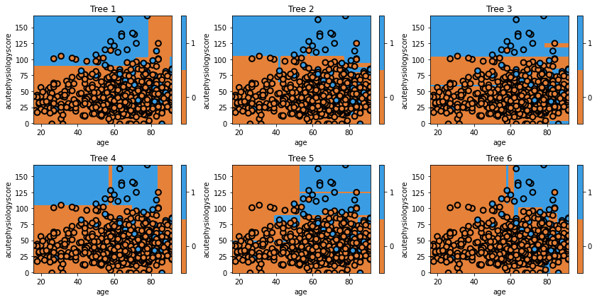
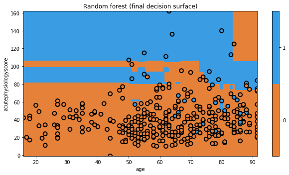

## Random Forest

In the previous example, we used bagging to randomly resample our data to generate "new" datasets. The Random Forest takes this one step further: instead of just resampling our data, we also select only a fraction of the features to include.

It turns out that this subselection tends to improve the performance of our models. The odds of an individual being very good or very bad is higher (i.e. the variance of the trees is increased), and this ends up giving us a final model with better overall performance (lower bias).

Let's train the model.

```python
np.random.seed(321)
mdl = ensemble.RandomForestClassifier(max_depth=5, n_estimators=6, max_features=1)
mdl = mdl.fit(x_train,y_train)

fig = plt.figure(figsize=[12,6])
for i, estimator in enumerate(mdl.estimators_):    
    ax = fig.add_subplot(2,3,i+1)
    txt = 'Tree {}'.format(i+1)
    glowyr.plot_model_pred_2d(estimator, x_train, y_train, title=txt)
```

{: width="900px"}

```python
plt.figure(figsize=[9,5])
txt = 'Random forest (final decision surface)'
glowyr.plot_model_pred_2d(mdl, x_train, y_train, title=txt)
```

{: width="900px"}

Again, the visualization doesn't really show us the power of Random Forests, but we'll quantitatively evaluate them soon enough.



