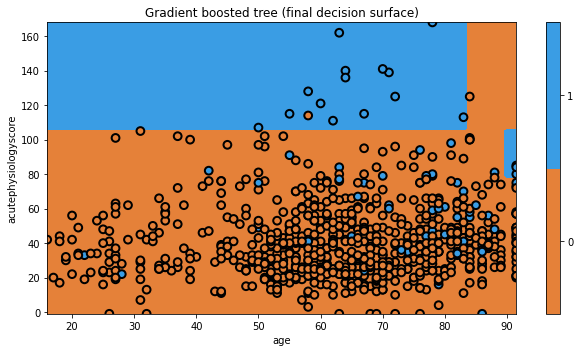

## Gradient boosting

Last, but not least, we move on to gradient boosting. Gradient boosting, our last topic, elegantly combines concepts from the previous methods. As a "boosting" method, gradient boosting involves iteratively building trees, aiming to improve upon misclassifications of the previous tree. Gradient boosting also borrows the concept of sub-sampling the variables (just like Random Forests), which can help to prevent overfitting.

While it is hard to express in this non-technical tutorial, the biggest innovation in gradient boosting is that it provides a unifying mathematical framework for boosting models. The approach explicitly casts the problem of building a tree as an optimization problem, defining mathematical functions for how well a tree is performing (which we had before) and how complex a tree is. In this light, one can actually treat AdaBoost as a "special case" of gradient boosting, where the loss function is chosen to be the exponential loss.

Let's build a gradient boosting model.

```python
np.random.seed(321)
mdl = ensemble.GradientBoostingClassifier(n_estimators=10)
mdl = mdl.fit(x_train, y_train)

plt.figure(figsize=[9,5])
txt = 'Gradient boosted tree (final decision surface)'
glowyr.plot_model_pred_2d(mdl, x_train, y_train, title=txt)
```

{: width="900px"}



