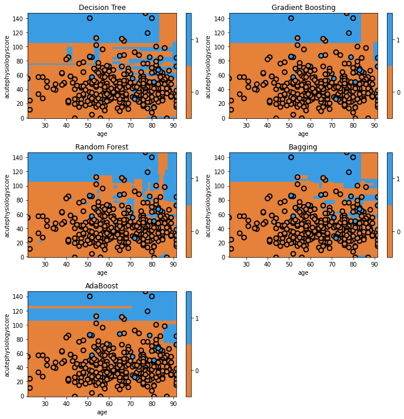

## Comparing model performance

We've now learned the basics of the various tree methods and have visualized most of them. Let's finish by comparing the performance of our models on our held-out test data. Our goal, remember, is to predict whether or not a patient will survive their hospital stay using the patient's age and acute physiology score computed on the first day of their ICU stay.

```python
from sklearn import metrics

clf = dict()
clf['Decision Tree'] = tree.DecisionTreeClassifier(criterion='entropy', splitter='best').fit(x_train,y_train)
clf['Gradient Boosting'] = ensemble.GradientBoostingClassifier(n_estimators=10).fit(x_train, y_train)
clf['Random Forest'] = ensemble.RandomForestClassifier(n_estimators=10).fit(x_train, y_train)
clf['Bagging'] =  ensemble.BaggingClassifier(n_estimators=10).fit(x_train, y_train)
clf['AdaBoost'] =  ensemble.AdaBoostClassifier(n_estimators=10).fit(x_train, y_train)

fig = plt.figure(figsize=[10,10])

print('AUROC\tModel')
for i, curr_mdl in enumerate(clf):    
    yhat = clf[curr_mdl].predict_proba(x_test)[:,1]
    score = metrics.roc_auc_score(y_test, yhat)
    print('{:0.3f}\t{}'.format(score, curr_mdl))
    ax = fig.add_subplot(3,2,i+1)
    glowyr. plot_model_pred_2d(clf[curr_mdl], x_test, y_test, title=curr_mdl)
```

{: width="900px"}

Here we can see that quantitatively, gradient boosting has produced the highest discrimination among all the models (~0.91). You'll see that some of the models appear to have simpler decision surfaces, which tends to result in improved generalization on a held-out test set (though not always!).

To make appropriate comparisons, we should calculate 95% confidence intervals on these performance estimates. This can be done a number of ways. A simple but effective approach is to use bootstrapping, a resampling technique. In bootstrapping, we generate multiple datasets from the test set (allowing the same data point to be sampled multiple times). Using these datasets, we can then estimate the confidence intervals.



